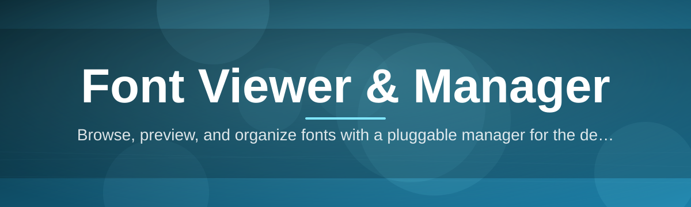

# font-viewer-manager

Browse, preview, and organize fonts with a pluggable manager for the desktop ecosystem

  

## Overview

Browse, preview, and organize fonts with a pluggable manager for the desktop ecosystem

## License

[MIT License](LICENSE)
